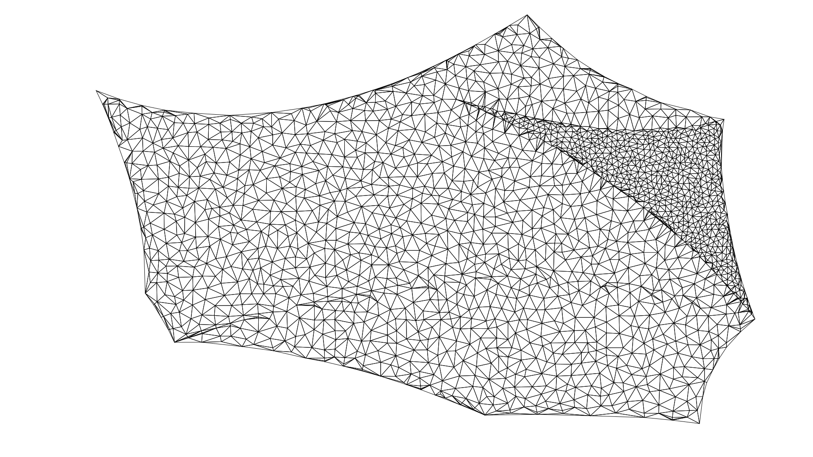
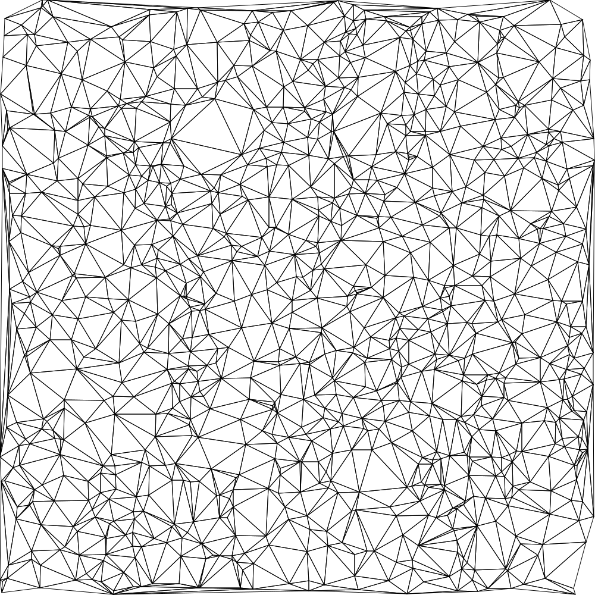

# Delaunay mesh

This package provides an implementation of the [Bowyer Watson][0] triangulation
algorithm to iteratively triangulate a set of points. This algorithm is not as
efficient as other triangulation algorithms (such as ear clipping) but it has
the advantage that the points do not have to known a priori. This is
particularly useful in cases where the triangulation itself decides which point
to insert next.

You can find some examples in the [`examples`][1] directory.

[0]: https://en.wikipedia.org/wiki/Bowyer%E2%80%93Watson_algorithm
[1]: https://github.com/d-dorazio/delaunay-mesh/tree/master/examples
